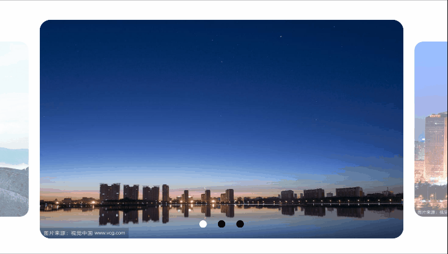
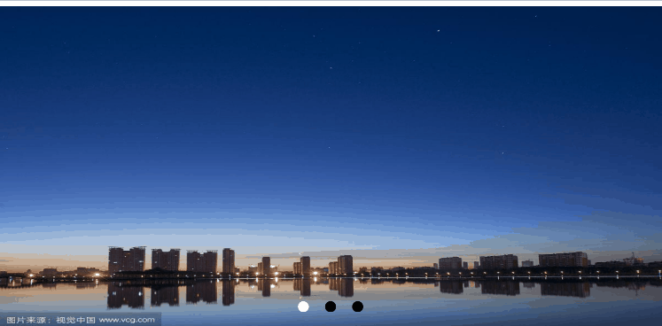
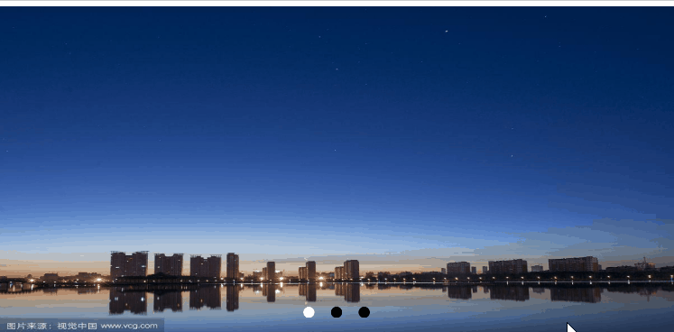

# BannerX

这是一款Android平台下的轮播控件，支持图片，视频以及图片视频混合轮播，支持自定义Item，自定义指示器，自定义切换动画以及自定义视频播放引擎。

## Preview


## Functions

#### 1.支持自定义轮播内容

轮播内容(图片,视频, 图片视频混合),三种轮播内容均支持 自动轮播，无限轮播，视频默认播放完毕切换下一个

#### 2. 支持自定义Item

#### 3.支持自定义指示器

#### 4.支持自定义Item切换效果

#### 5.支持自定义视频播放引擎

#### 6. 支持自定义Item圆角

## Installation

```
 repositories {
        mavenCentral()
 }
 
 implementation 'io.github.shiwebsw:bannerx:1.1.0'
```

## Usage

xml

```
        <com.android.view.bannerx.library.BannerX
            android:id="@+id/bannerX"
            android:layout_width="match_parent"
            android:layout_height="200dp"
            app:layout_constraintBottom_toBottomOf="parent"
            app:layout_constraintLeft_toLeftOf="parent"
            app:layout_constraintRight_toRightOf="parent"
            app:layout_constraintTop_toTopOf="parent" />        
```

kotlin

```
            val banners = mutableListOf<String>(
                "https://t7.baidu.com/it/u=1956604245,3662848045&fm=193&f=GIF",
                "https://t7.baidu.com/it/u=938052523,709452322&fm=193&f=GIF",
                "https://t7.baidu.com/it/u=825057118,3516313570&fm=193&f=GIF"
            )

            bannerX.apply {
                val indicatorView = IndicatorView(this@MainActivity)
                    .setIndicatorColor(Color.BLACK)
                    .setIndicatorSelectorColor(Color.WHITE)
                    .setIndicatorStyle(INDICATOR_CIRCLE_RECT)
                setIndicator(indicatorView)
                setAdapter(object : DefaultImageAdapter<String>(banners) {
                    override fun onBindViewHolder(holder: DefaultImageHolder, position: Int) {
                        super.onBindViewHolder(holder, position)
                        Glide.with(holder.itemView).load(banners[position]).into(holder.img)
                    }
                })
                start()
            }
```

BannerX 内置了三种默认的Adapter

|Adapter|描述|效果|
|---|---|---|
|DefaultImageAdapter|纯图片轮播||
|DefaultRcLayoutAdapter|圆角Item轮播||
|DefaultVideoAdapter|视频&图片轮播||

默认图片Adapter

```
                setAdapter(object : DefaultImageAdapter<String>(banners) {
                    override fun onBindViewHolder(holder: DefaultImageHolder, position: Int) {
                        super.onBindViewHolder(holder, position)
                        Glide.with(holder.itemView).load(banners[position]).into(holder.img)
                    }
                })
```

默认圆角图片Adapter

```
                setAdapter(object : DefaultRcLayoutAdapter<String>(10.0f, banners) {
                    override fun onBindViewHolder(holder: DefaultImageHolder, position: Int) {
                        super.onBindViewHolder(holder, position)
                        Glide.with(holder.itemView).load(banners[position]).into(holder.img)
                    }
                })
```

默认视频&图片Adapter

```
                setAdapter(object : DefaultVideoAdapter(bannerX.getPlayer(), banners) {
                    override fun onBindViewHolder(holder: DefaultVideoHolder, position: Int) {
                        super.onBindViewHolder(holder, position)
                        if (getItemViewType(position) == TYPE_IMG)
                            Glide.with(holder.itemView).load(banners[position]).into(holder.ivImg!!)
                    }
                })
```

默认Adapter如果不满足样式，参考默认实现及具体需求自定义即可。

### 注意：BannerX没有处理Item点击事件，如果需要请在Adapter中自行处理。

## APIS

|Attributes|format|describe
|---|---|---|
|bannerx_loop_time|integer|轮播间隔时间，默认3000
|bannerx_auto_loop|boolean|是否自动轮播，默认true
|bannerx_orientation|enum|轮播方向：horizontal（默认） or vertical

|方法名|描述|
|---|---|
|setAdapter()|设置Adapter
|setNewDatas()|重新设置数据源
|setIndicator()|设置轮播指示器
|start()|开始轮播
|destroy()|销毁bannerx
|setIsAutoLoop()|是否自动轮播
|setIsInfiniteLoop()|是否无限轮播
|setLoopTime()|设置自动轮播的时间间隔，单位ms
|setScrollTime()|设置Item切换过程中的时间
|getScrollTime()|获取Item切换过程中的时间
|getViewPager2()|获得当前的ViewPage2实例
|addPageTransformer()|增加Item切换效果
|removePageTransformer()|移除Item切换效果
|getCurrentTransformers()|获得当前切换效果集合（切换效果可以叠加，所以返回的是一个集合）
|removeAllTransformers()|移除当前所有切换效果
|setUserInputEnabled()|是否可以手势滑动切换
|setOrientation()|Viewpage2滚动方向
|useThreePagesOnOneScreen()|开启一屏三页效果
|setPageMargin()|左右或上下间距
|setCurrentItem()|设置当前Item
|getPlayer()|获取当前的VidePlayer实例，通过此方法实现Player的控制
|setPlayer()|设置自定义的player引擎，默认使用的是Exoplayer
|setVideoPlayWhenReady()|播放器准备完成时候立即播放

### Transformer

参考自：[Github](https://github.com)

|描述|效果|
|---|---|
|AccordionTransformer||
|BackgroundToForegroundTransformer||
|CubeInTransformer||
|CubeOutTransformer||
|DepthPageTransformer||
|DrawerTransformer||
|FlipHorizontalTransformer||
|FlipVerticalTransformer||
|ForegroundToBackgroundTransformer||
|RotateDownTransformer||
|RotateUpTransformer||
|ScaleInOutTransformer||
|StackTransformer||
|TabletTransformer||
|ZoomInTransformer||
|ZoomOutSlideTransformer||
|ZoomOutTransformer||


### Indicator

参考自：[https://github.com/zguop/banner](https://github.com/zguop/banner)

|方法名|描述|
|---|---|
|setIndicatorStyle|共有4种切换效果，详见下表|
|setIndicatorColor|未选中颜色|
|setIndicatorSelectorColor|选中颜色|
|setIndicatorSpacing|选中颜色|
|setIndicatorRadius|设置indicator的圆角，同时会改变选中时的圆角，default 3.5dp|
|setIndicatorRatio|设置indicator比例，拉伸圆为矩形，控制该比例，default 1.0|
|setIndicatorSelectorColor|设置点与点之间的距离，default dp10|
|setIndicatorSelectedRatio|设置选中圆比例，拉伸圆为矩形，控制该比例，默认比例和indicatorRatio一致|
|setIndicatorSelectedRadius|设置选中的圆角，没有设置，默认和indicatorRadius值一致|

|描述|效果|
|---|---|
|INDICATOR_BEZIER||
|INDICATOR_CIRCLE||
|INDICATOR_CIRCLE_RECT||
|INDICATOR_DASH||

# License

```
   Copyright (c) 2021-present, shiweibsw.

   Licensed under the Apache License, Version 2.0 (the "License");
   you may not use this file except in compliance with the License.
   You may obtain a copy of the License at

       http://www.apache.org/licenses/LICENSE-2.0

   Unless required by applicable law or agreed to in writing, software
   distributed under the License is distributed on an "AS IS" BASIS,
   WITHOUT WARRANTIES OR CONDITIONS OF ANY KIND, either express or implied.
   See the License for the specific language governing permissions and
   limitations under the License.

```
